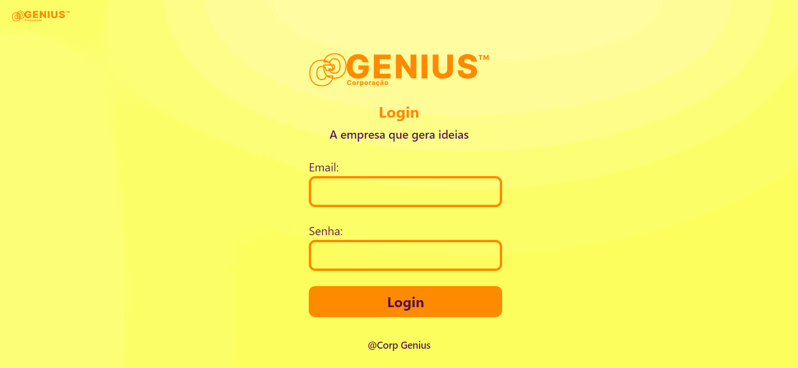
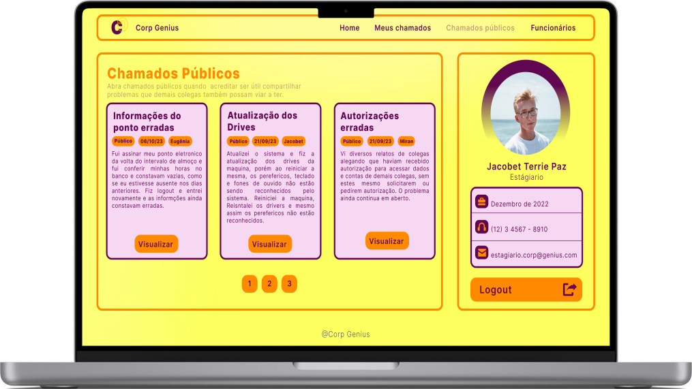

<h1 align="center">
    
    <p>The company that generates ideas<br> 
    A empresa que gera idéias</p>
</h1>
<h3 align="center"><a href="#">See the project here!<br>
Veja o projeto aqui!</a></h3>
<hr>

<br>

## 📸 About
This project is an extension of internal tools for the company Corp Genius, expertly developed using HTML, CSS, Bootstrap and PHP. With a responsive and optimized design, the browsing experience is fluid across multiple devices. The contact form is powered by a PHP solution, ensuring sharing or not, and it is up to the user to decide whether to call the administrator. The project also includes additional sections for other employees to view, such as their contract period and contact details.

Este projeto é estenção de ferramentas internas para a empresa Corp Genius, habilmente desenvolvido utilizando HTML, CSS, Bootstrap e PHP. Com um design responsivo e otimizado, a experiência de navegação é fluida em múltiplos dispositivos. O formulário de contato é alimentado por uma solução PHP, garantindo o compartilhamento ou não, cabendo ao usuário decidir, dos chamados para o administrador. O projeto também inclui seções adicionais para a visualizações de demais funcionários, como o período de contrato e o contato deles.

<br> 

## 🔧 Tools

- [Bootstrap 5](https://getbootstrap.com/docs/5.0/getting-started/introduction/)
- [PHP](https://www.php.net/)

<br>

## 📸 More Images





<br>

## 💡 How contribute

```bash
    #clone the project
    $git clone https://github.com/Ester-Farias/Projeto-Corp-Genius.git
```

```bash
    #Enter directory
    $ cd Projeto-Corp-Genius
```

```bash
    #Install the dependencies, if use npm
    $ npm install
```
<p align="center">Or</p>

```bash
    #Install the dependencies, if use yarn
    $ yarn
```

## 📃 License
This project is under the MIT license. See the file [LICENSE](https://github.com/Ester-Farias/Portfolio-fotografo-rafael-silva/blob/master/LICENSE) for more details.